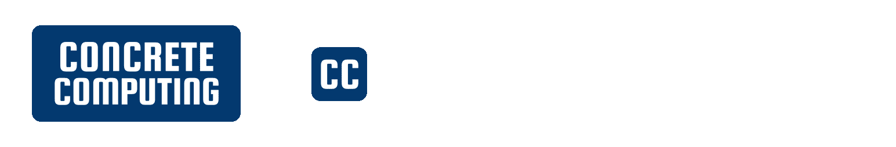
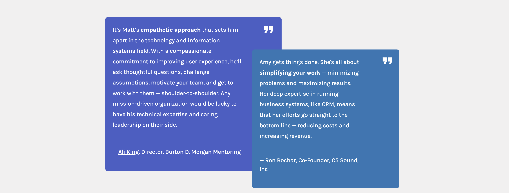
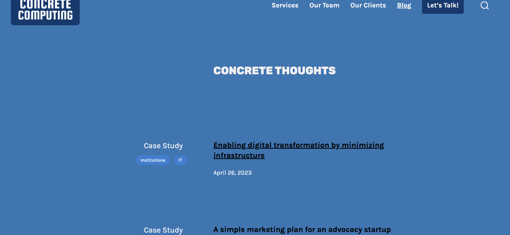

---
#### [Concrete Computing website](https://concretecomputing.com)
## The brief
My client had a website on GoDaddy's default [Go theme](https://wordpress.org/themes/go/).  
He didn't need many bells and whistles, but he did need to quickly improve his website's design improve and reflect the core of his business – delivering dependable IT services.

## The solution
I created a new logo – a simple but strong lockup that rhymes with his buttons to convey the ease that he brings to technology solutions. 
I created a matching favicon to give a strong presense right from the address bar and bookmarks.

I created a child theme and tweaked the design to be simple yet sophisticated with design modules for  testimonials and a call to action.

Brutalist photography helped to lend a sense of serenity within complexity.
I chose a colorful but muted business blue as the main color, with purple and teal as accents, and fuschia for the links for a small pop of vibrancy. 

For the blog page I let the blue of the header expand over the whole body – a change of tone to help transition to the change in content. 

