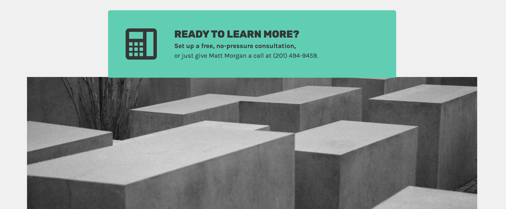

### [Concrete Computing website](https://concretecomputing.com)

The bried was to realign this website that was on GoDaddy's default Go theme.  
I created a child theme and tweaked the design to be simple but sophisticated, reflecting Matt Morgan's easy manner and professional results.  
We choose to roll with the same color scheme but desturating the blue making it a bit more solemn.  
The brutalist architecture was Matt's idea.  
I added a few more shades of blue for depth, and a fuschia for pop.

I added the following editable features:
- imagery set with Featured Image
- tabbed toggle
- favicon
- testimonials 
- a bold CTA

---

##### Call to Action:

##### Blog

