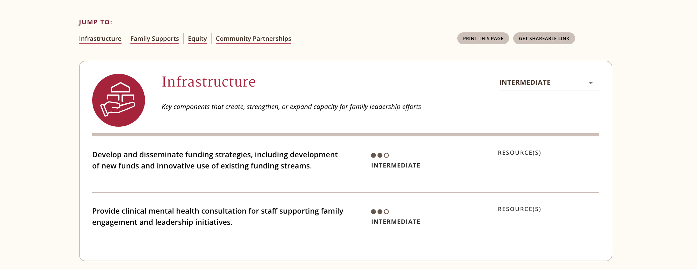

#### [Educare Quiz Website](https://familyleadership.educareschools.org/)

## The brief
In addition to a website the client requested a quiz with some special features.
That it be paginated and categorized, and that it would guide the user through their results per category, and then recommendations based on those results. 

This site was designed by and built for my long time collaborator, *Serendipity Creative*.  

---

### The solution

Gravity Forms is a popular WordPress plugin for building and managing forms.  
It has a Quiz add-on that I started to investigate.  
It could handle pagination but not categories nor provide any templating for working with results data.

Since it satisfied a decent amount of the requirement I started looking into adding other features.

I found in settings that the results page configuration had an option to output a customizable query string.  
I realized this would facilitate meeting the other requirements. 

By labeling each question key with the category I was able to handoff the data to my PHP templates.  
`?cat1=10&cat1=20&cat2=20...`  
The downside was that the app would be slightly brittle - if any questions change the categories would have to be updated in the query string output, not on the question admin itself.  
Given the budget and timeline and lifecycle it was deemed a good trade-off.

Taking the output of the quiz and crunching scores and queries was a lot of fun.  
The client was very pleased and has reported a large uptick in engagement.