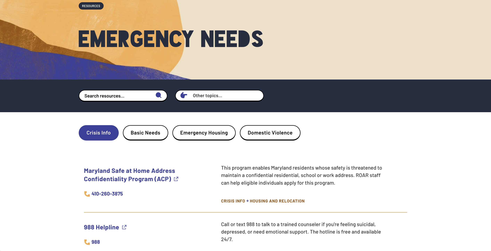
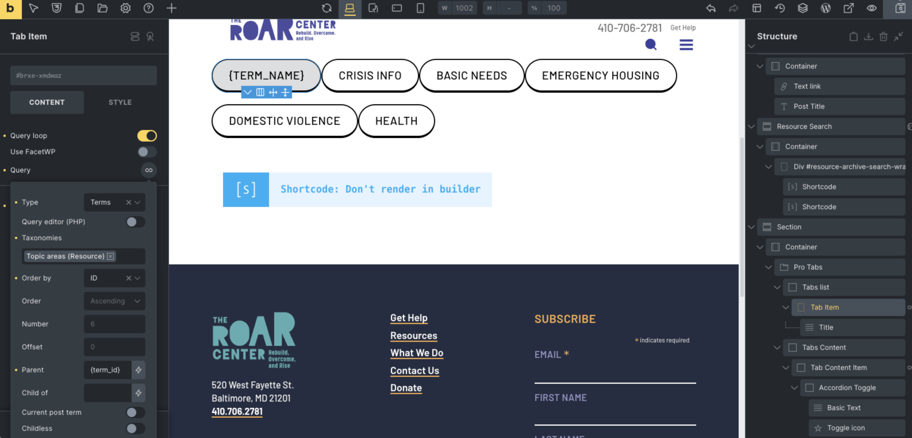

#### [ROAR Foundation](https://roarcenter.org)

## The brief
To build out a medium/large highly bespoke website using a WordPress builder for ease of modification by non-technical administrators, but also wouldn't hamper performance or development.  

This site was built for my long time collaborator, *Serendipity Creative*.  

## The solution
I’m not a fan of WordPress builders.  
This client had previously been using Divi which I was none too please about.  
They also came to realize the debt Divi caused and we decided to find something better.
We settled on Bricks Builder was a beta plugin at the time with a more developer friendly ethos.

### Clever queries in tabs
One example of how this builder helped development:
the Resources post type [**category archive**](https://roarcenter.org/topic-area/emergency-needs/) page was designed to display a tabbed layout of sub categories.

Normally in a situation like this a shortcode would be injected, replacing the builder for that component.  
As I played with *Pro Tabs from Bricks Extras* I found I was able to set the tabs titles **parent** and contents **child** to the main query term_ID and render this semi-complex UI directly within the builder tools, losing zero Bricks functionality.

